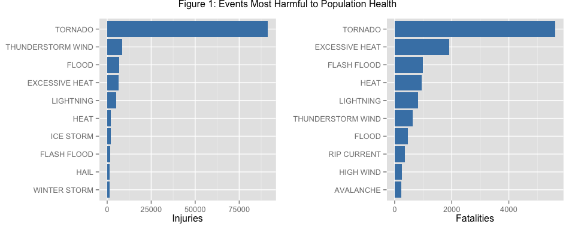
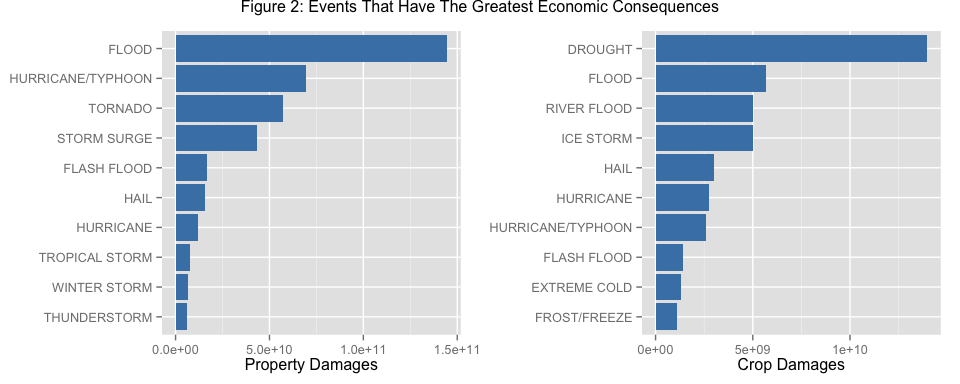

## Programming Assigment 2
## Impact of Severe Weather Events on US Health and Economics
### Author: Zdravka Cankova   

---

#### Synopsis

Severe weather events can often result in serious damages to a country's economy and population health. The purpose of this assignment was to use the U.S. National Oceanic and Atmospheric Administration's (NOAA) storm database to determine the weather events that have the greatest consequences, in terms of polulation heath and economic impact during the years 1950 to 2011. The effect on population health was measured in terms of injuries and fatalities, and the economic aftermath was measured in terms of property and crop damages.   
   
#### Data Processing

First, the data was obtained from the course web site ([Storm Data](https://d396qusza40orc.cloudfront.net/repdata%2Fdata%2FStormData.csv.bz2)) and loaded into R:

```r
StormData<-read.csv(bzfile("repdata_data_StormData.csv.bz2"))
```

***Public Health Impact***
   
The impact of severe weather events on public health was measured in terms of injuries and fatalities vs. event type. First, the data was split into a subset that only contained the event type, year, injuries and fatalities. This involved converting the data to a date format. The abbreviation "TSTM" was also replaced by "THUNDERSTORM" in an attempt to consolidate some of the event types.

```r
library(lubridate)

StormDataHealth <- subset(StormData, INJURIES != 0 | FATALITIES != 0, select = c(BGN_DATE, EVTYPE, INJURIES, FATALITIES))
StormDataHealth$YEAR <- year(strptime(StormDataHealth$BGN_DATE, "%m/%d/%Y %H:%M:%S"))
StormDataHealth$BGN_DATE <- NULL
StormDataHealth$EVTYPE <- toupper(StormDataHealth$EVTYPE)
StormDataHealth$EVTYPE <- gsub("TSTM", "THUNDERSTORM", StormDataHealth$EVTYPE)
StormDataHealth <-aggregate(cbind(INJURIES, FATALITIES) ~ YEAR + EVTYPE,
                            data = StormDataHealth, sum)
```

Then, the injuries were aggregated based on event type. A bar graph showing the top ten events with the most injuries was then prepared.

```r
library(ggplot2)
library(grid)
library(gridExtra)

InjuriesByEvent <- aggregate(INJURIES~EVTYPE, data=StormDataHealth, sum)
InjuriesByEvent <- InjuriesByEvent[order(InjuriesByEvent$INJURIES,
                                         decreasing = TRUE),]
InjuriesByEvent$EVTYPE <- factor(InjuriesByEvent$EVTYPE,
                                 levels = InjuriesByEvent$EVTYPE)

Injuries <- ggplot(InjuriesByEvent[1:10, ],
                aes(x = reorder(EVTYPE, INJURIES), y = INJURIES)) +
      geom_bar(stat = "identity", fill = "steelblue") +
      labs(x = NULL, y = "Injuries") +
      coord_flip()
```

Using the same procedure, a bar graph showing the top ten events with the most fatalities was also prepared.

```r
FatalitiesByEvent <- aggregate(FATALITIES~EVTYPE, data=StormDataHealth, sum)
FatalitiesByEvent <- FatalitiesByEvent[order(FatalitiesByEvent$FATALITIES,
                                             decreasing = TRUE),]
FatalitiesByEvent$EVTYPE <- factor(FatalitiesByEvent$EVTYPE,
                                   levels = FatalitiesByEvent$EVTYPE)

Fatalities <- ggplot(FatalitiesByEvent[1:10, ], 
                aes(x = reorder(EVTYPE, FATALITIES), y = FATALITIES)) +
      geom_bar(stat = "identity", fill = "steelblue") +
      labs(x = NULL, y = "Fatalities") +
      coord_flip()
```

The following code can be used to display the two bar graphs representing the public health impact (output shown in Figure 1 in the Results section).

```r
Figure1 <- grid.arrange(Injuries, Fatalities, ncol = 2, 
                        main = "Figure 1: Events Most Harmful to Population Health")
```

***Economic Impact***
   
The economic impact of severe weather events was measured in terms of property and crop damages vs. event type. First, the data was split into a subset that only contained the event type, year, property and crop damages. Again, the data was converted to a date format, and the abbreviation "TSTM" was replaced by "THUNDERSTORM".

```r
StormDataEconomic <- subset(StormData, PROPDMG != 0 | CROPDMG != 0, select = c(BGN_DATE, EVTYPE, PROPDMG, PROPDMGEXP, CROPDMG, CROPDMGEXP))
StormDataEconomic$YEAR <- year(strptime(StormDataEconomic$BGN_DATE,
                                        "%m/%d/%Y %H:%M:%S"))
StormDataEconomic$BGN_DATE <- NULL
StormDataEconomic$EVTYPE <- toupper(StormDataEconomic$EVTYPE)
StormDataEconomic$EVTYPE <- replace(StormDataEconomic$EVTYPE,
                                    grep("TSTM", StormDataEconomic$EVTYPE),
                                    "THUNDERSTORM")
StormDataEconomic$PROPDMGEXP <- toupper(StormDataEconomic$PROPDMGEXP)
StormDataEconomic$CROPDMGEXP <- toupper(StormDataEconomic$CROPDMGEXP)
```

The property and crop damage columns were converted to numeric values based on the exponent indicatiors in the corresponding damage exponent columns. This was done using the function "CleanUpDamage", as defined in the code below:

```r
CleanUpDamage<-function(DMGEXP, DMG) {
      DMGEXP[DMGEXP == "?" | DMGEXP == "-" | DMGEXP == ""] <- 0
      DMGEXP[DMGEXP == "+"] <- 1
      DMGEXP[DMGEXP == "H"] <- 100
      DMGEXP[DMGEXP == "K"] <- 1000
      DMGEXP[DMGEXP == "M"] <- 1000000
      DMGEXP[DMGEXP == "B"] <- 1000000000
      
      for (i in 1:length(DMGEXP)) {
            if (grepl("^[0-9]$", DMGEXP[i], perl = TRUE)) {
                  DMGEXP[i] <- 10^as.numeric(DMGEXP[i])
                  }   
            } 
      DMG <- as.numeric(DMG) * as.numeric(DMGEXP)
      return(DMG)
      }

StormDataEconomic$PROPDMG <- CleanUpDamage(StormDataEconomic$PROPDMGEXP,
                                           StormDataEconomic$PROPDMG)
StormDataEconomic$CROPDMG <- CleanUpDamage(StormDataEconomic$CROPDMGEXP,
                                           StormDataEconomic$CROPDMG)
```

Then the economic impact data was organized via the same method used to evaluate the public health impact. This resulted in the generation of two bar plots showing the top ten events with the most property and crop damages.

```r
StormDataEconomic <-aggregate(cbind(PROPDMG, CROPDMG) ~ YEAR + EVTYPE,
                            data = StormDataEconomic, sum)

PropDmgByEvent <- aggregate(PROPDMG~EVTYPE, data=StormDataEconomic, sum)
PropDmgByEvent <- PropDmgByEvent[order(PropDmgByEvent$PROPDMG,
                                         decreasing = TRUE),]
PropDmgByEvent$EVTYPE <- factor(PropDmgByEvent$EVTYPE,
                                 levels = PropDmgByEvent$EVTYPE)

PropDamage <- ggplot(PropDmgByEvent[1:10, ],
                aes(x = reorder(EVTYPE, PROPDMG), y = PROPDMG)) +
      geom_bar(stat = "identity", fill = "steelblue") +
      labs(x = NULL, y = "Property Damages") +
      coord_flip()

CropDmgByEvent <- aggregate(CROPDMG~EVTYPE, data=StormDataEconomic, sum)
CropDmgByEvent <- CropDmgByEvent[order(CropDmgByEvent$CROPDMG,
                                         decreasing = TRUE),]
CropDmgByEvent$EVTYPE <- factor(CropDmgByEvent$EVTYPE,
                                 levels = CropDmgByEvent$EVTYPE)

CropDamage <- ggplot(CropDmgByEvent[1:10, ],
                aes(x = reorder(EVTYPE, CROPDMG), y = CROPDMG)) +
      geom_bar(stat = "identity", fill = "steelblue") +
      labs(x = NULL, y = "Crop Damages") +
      coord_flip()
```

The following code can be used to display the two bar graphs representing the economic impact (output shown in Figure 2 in the Results section).

```r
Figure2 <- grid.arrange(PropDamage, CropDamage, ncol = 2, 
                        main = "Figure 2: Events That Have The Greatest Economic Consequences")
```
   
#### Results   

***Public Health Impact***   

The top ten events most harmful to population health in the US are shown in Figure 1.
   
 

The graphs clearly show that **tornadoes** have the greatest impact on public health, both in terms of injuries (91,346) and fatalities (5,633).

***Economic Impact***   

The top ten events with greatest economic consequences in the US are shown in Figure 2.
   
 

In terms of property damages, **floods** have the greatest economic impact ($144,657,709,807). In terms of crop damages, the greatest economic consequences result from **droughts** ($13,972,566,000).
